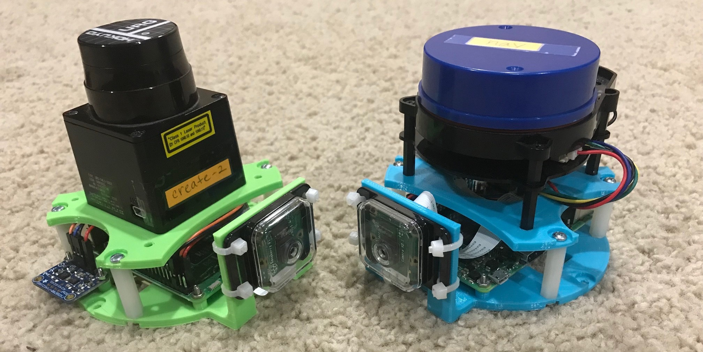
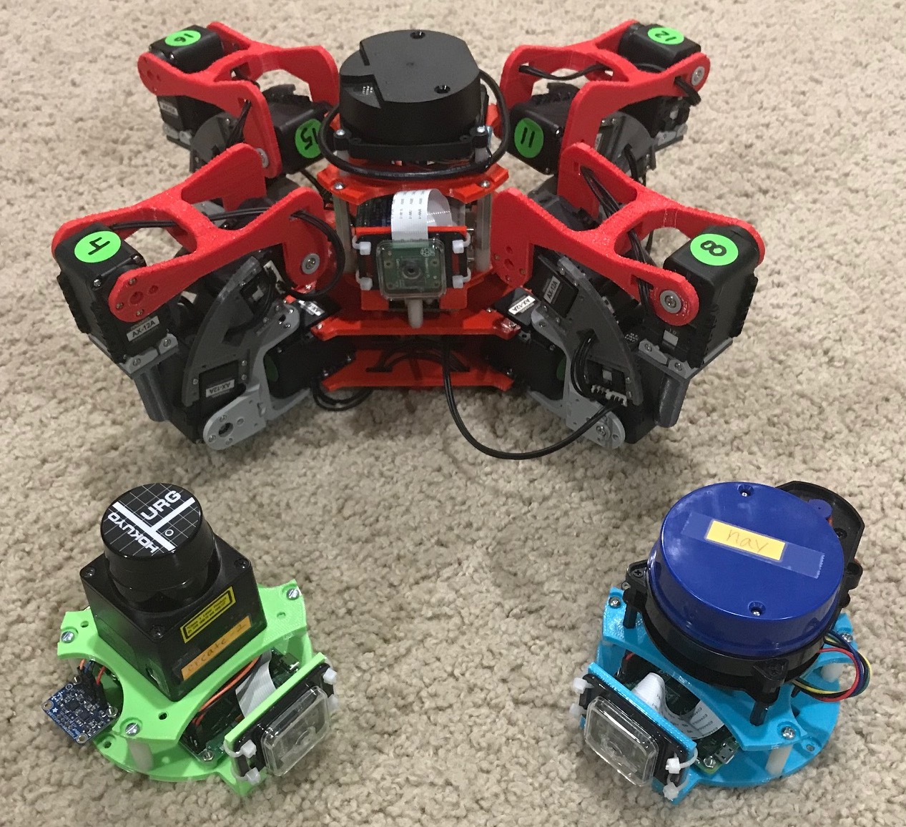
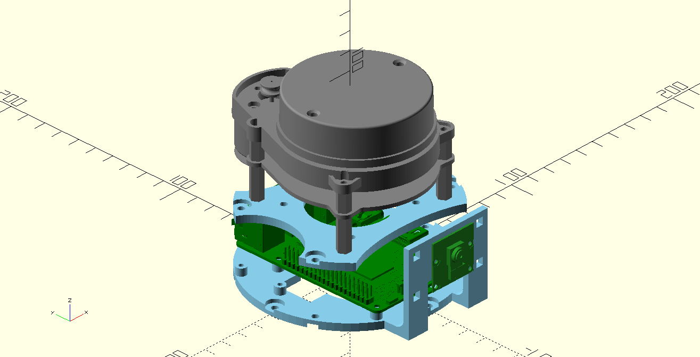

# Inertial Navigation System

**still under development**

This was originally part of another (much more complex) robot I was building. I decided to break it out into its own repo.

## Mechanical

This is designed using [OpenScad](http://www.openscad.org/) which is a solid modeller. There are printable 3d stl files available in the mechanical directory along with the scad file that created them. You will also need:

- 4 4-40 1 inch stand offs
- 8 4-40 machine screws
- 6 2-56 machine screws and nuts (for the IMU and Raspberry Pi)
- 4 zip ties (secure camera case to mount)

## Electronics

You will need:

- [Raspberry Pi 3](https://www.adafruit.com/product/3055)
- [NXP 9-DOF i2c IMU](https://www.adafruit.com/product/3463): accelerometer, gyros, and magnetometer
- [Pi Camera](https://www.adafruit.com/product/3099)
- [Pi Camera Case](https://www.adafruit.com/product/3253), I like the clear front to see the camera module
- Lidar: URG or ydLidar are good
- 5V 2.5A power source
- 4 female-to-female jumper cables (IMU to RPi)

## Software

You will need to install the following Python 3 libraries using `pip`:

- pydar
- ins_nav
- nxp_imu
- sslam
- squaternion

## Vision

You will also need OpenCV 4.x to use this. Unfortunately for the Raspberry Pi, at the time of this writting, there is no easy way to do this. You will have to build/compile it yourself for Python 3.

<footer>
Software is licensed under MIT or other, see software for details.

Documentation and 3d models are licensed under a <a rel="license" href="http://creativecommons.org/licenses/by-sa/4.0/">Creative Commons Attribution-ShareAlike 4.0 International License</a>.
 

</footer>
